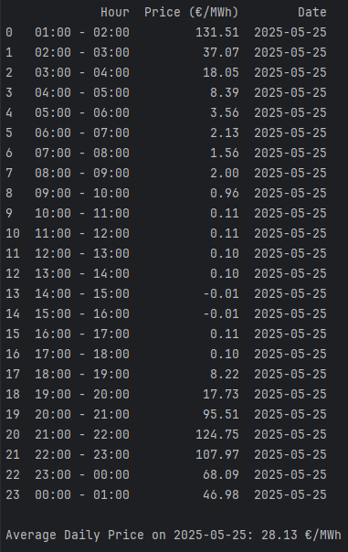
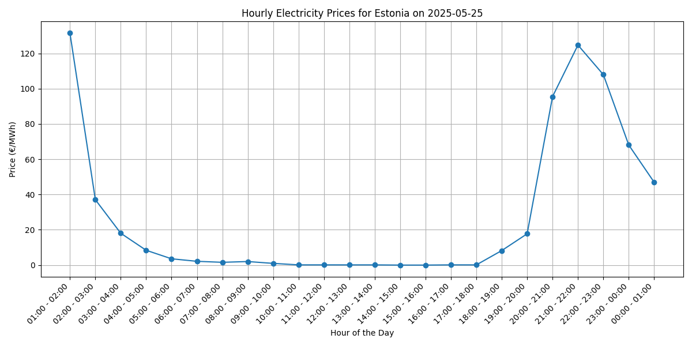

# Kodutöö Protsessikirjeldus

## Ülesanne
Kodutöö eesmärgiks oli luua skript, mis teostab järgmised sammud:
1.  **Veebist andmete kogumine**: Koguda ühe valitud kuupäeva (nt tänane või eelnev päev) Eesti piirkonna elektrihinnad tundide kaupa Nord Pooli börsilt. Andmestik peab sisaldama vähemalt kuupäeva, kellaaega/tundi (0–23) ja hinda eurodes megavatt-tunni kohta (€/MWh). Andmete kogumine ei tohi olla käsitsi kopeerimine ega sisestamine.
2.  **Andmete töötlemine**: Koostada andmetabel, kus iga rea kohta on üks tund ja selle hind, ning arvutada päeva keskmine hind.
3.  **Visualiseerimine**: Luua vähemalt üks visualiseering, mis kujutab tunni täpsusega hinnamuutust ühe päeva jooksul.

## 1. Tööprotsessi, tehtud töö ja leitud tulemuste kirjeldus

### Tööprotsess
Antud ülesande lahendamiseks kasutati Pythoni programmeerimiskeelt ja mitmeid selle teeke.

**Kasutatud tehnoloogiad ja teegid:**
*   **Python 3**: Programmeerimiskeel.
*   **Selenium**: Veebilehitseja (Firefox koos `geckodriver`'iga) automatiseerimiseks, et pääseda ligi Nord Pooli dünaamiliselt laetavale sisule. Vajalik, kuna leht kasutab JavaScripti andmete kuvamiseks.
*   **BeautifulSoup4**: HTML-i parsimiseks, et eraldada veebilehelt vajalikud andmed (tunnid ja hinnad) pärast Seleniumiga sisu kättesaamist.
*   **Pandas**: Andmete struktureerimiseks, manipuleerimiseks ja analüüsiks. Kasutati DataFrame'i loomiseks, andmete puhastamiseks ja keskmise hinna arvutamiseks.
*   **Matplotlib**: Andmete visualiseerimiseks, täpsemalt tunnipõhise hinnagraafiku loomiseks.
*   **os**: Failisüsteemi operatsioonideks, näiteks visualiseeringute kausta loomiseks.

**Protsessi sammud:**
1.  **URL-i konstrueerimine**: Skript koostab dünaamiliselt Nord Pooli veebilehe URL-i, kasutades etteantud sihtkuupäeva (`target_date`) ja fikseeritud parameetreid Eesti (`EE`) hinnapiirkonna ning valuuta (`EUR`) jaoks.
2.  **Dünaamilise sisu laadimine Seleniumiga**: Käivitatakse Firefoxi veebilehitseja Seleniumi abil, navigeeritakse koostatud URL-ile. Skript ootab, kuni dünaamiline andmetabel (`dx-data-row` klassiga elemendid) on lehele laetud. Seejärel hangitakse lehe täielik HTML-kood.
3.  **Andmete parsimine BeautifulSoupiga**: Saadud HTML-koodist eraldatakse BeautifulSoup abil andmetabeli read. Igast reast loetakse välja tunnivahemik ja elektrihind. Hinnad puhastatakse (eemaldatakse tuhandike eraldajad, koma asendatakse punktiga) ja konverteeritakse numbriliseks väärtuseks.
4.  **Andmete struktureerimine Pandas DataFrame'iks**: Kogutud tunnid ja hinnad paigutatakse Pandas DataFrame'i. Lisatakse ka `Date` (kuupäev) ja `Start Hour` (tunnivahemiku algustund numbrina, nt "00-01" -> 0) veerud.
5.  **Keskmise hinna arvutamine**: Pandas DataFrame'i hinna veeru põhjal arvutatakse päeva keskmine elektrihind.
6.  **Visualiseerimine Matplotlibiga**: Luuakse joongraafik, mis näitab elektrihinna muutumist päeva jooksul. Graafikule lisatakse pealkiri, telgede sildid, ruudustik ja päeva keskmist hinda tähistav horisontaaljoon.
7.  **Graafiku salvestamine**: Valminud graafik salvestatakse `.png` formaadis failina `visualizations` alamkausta. Kaust luuakse automaatselt, kui see ei eksisteeri. Failinimi sisaldab sihtkuupäeva.

### Leitud tulemused
*   Skript kogub edukalt 24 tunnipõhist elektrihinda Nord Pooli lehelt valitud kuupäeva kohta Eesti hinnapiirkonnas.
*   Andmed struktureeritakse korrektselt Pandas DataFrame'i, mis sisaldab kuupäeva, tunnivahemikku (tekstina), algustundi (numbrina) ja hinda (€/MWh).
*   Arvutatakse ja kuvatakse päeva keskmine elektrihind. 
*   Genereeritakse selge ja informatiivne visualiseering (nt `visualizations/nordpool_prices_20250520.png`), mis näitab elektrihinna kõikumist päeva lõikes ning päeva keskmist hinda.

## 2. Kasutatud programmide/teekide valiku põhjendus

*   **Python**: Valitud oma mitmekülgsuse, laia teekide valiku ja tugeva kogukonna tõttu. Sobib hästi veebist andmete kogumiseks, andmeanalüüsiks ja visualiseerimiseks.
*   **Selenium**: Vältimatu Nord Pooli lehe puhul, kuna hinnatabel laetakse dünaamiliselt JavaScripti abil. Ilma Seleniumita (või sarnase tööriistata) ei oleks võimalik täielikku HTML-i kätte saada.
*   **BeautifulSoup4**: Pärast HTML-i kättesaamist on BeautifulSoup efektiivne ja kasutajasõbralik vahend vajalike andmete (antud juhul tabeliridade ja -veergude) eraldamiseks HTML-struktuurist.
*   **Pandas**: Standardne valik Pythonis tabelandmetega töötamiseks. `DataFrame` pakub mugavat viisi andmete hoidmiseks, puhastamiseks, transformeerimiseks ja agregeeritud näitajate (nagu keskmine hind) arvutamiseks.
*   **Matplotlib**: Laialdaselt kasutatav ja paindlik teek Pythonis staatiliste, animeeritud ja interaktiivsete visualiseeringute loomiseks. Sobis hästi antud ülesande jaoks lihtsa, kuid informatiivse joongraafiku tegemiseks.
*   **os**: Standardne Pythoni teek operatsioonisüsteemiga suhtlemiseks, antud juhul vajalik kaustade loomiseks failisüsteemis.

## 3. Täpsustused automatiseerimiseks ja igapäevaseks andmebaasi uuendamiseks

Kodutöös esitatud skript on mõeldud ühekordseks andmete kogumiseks kindla kuupäeva kohta. Selle protsessi täielikuks automatiseerimiseks ja andmete igapäevaseks uuendamiseks andmebaasis tuleks teha järgmised täiendused:

### A. Skripti muudatused:
1.  **Dünaamiline kuupäeva määramine**: Skript peaks automaatselt määrama sihtkuupäevaks eelmise päeva (nt `datetime.now() - timedelta(days=1)`), et koguda alati värskeimad lõplikud päevahinnad.
2.  **Robustne vigade käsitlemine ja logimine**: Lisada põhjalikum vigade püünised (nt `try-except` blokid kriitilistes kohtades) ja logimismehhanism (kasutades Pythoni `logging` moodulit), et salvestada skripti töö käik ja võimalikud probleemid (nt võrguvead, lehe struktuuri muutused).
3.  **Korduskatsed**: Implementeerida korduskatsete loogika juhuks, kui andmete laadimine ebaõnnestub ajutiste probleemide tõttu (nt Nord Pooli leht ei vasta kohe).
4.  **Konfiguratsioonifailid**: Välised parameetrid (nt ooteajad, URL-i osad, andmebaasi ühenduse info) võiksid olla eraldi konfiguratsioonifailis, mitte otse koodis.

### B. Andmebaasi integratsioon:
1.  **Andmebaasi valik**: Sõltuvalt mahust ja vajadustest võiks valida sobiva andmebaasi.
2.  **Andmebaasi skeem**: Luua andmebaasis tabel elektrihindade salvestamiseks (nt `electricity_prices` veergudega `price_timestamp` (või `date` ja `hour` eraldi), `price_eur_mwh`, `region`).
3.  **Andmete sisestamine**: Lisada skripti kood, mis ühendub andmebaasiga ja sisestab kogutud andmed tabelisse. Tuleks käsitleda ka olukorda, kus andmed võivad juba olemas olla (nt `INSERT ... ON CONFLICT DO NOTHING` või uuendamine).

### C. Protsessi ajastamine ja monitooring:
1.  **Ajastamine (Scheduling)**: Skripti regulaarseks käivitamiseks kasutada operatsioonisüsteemi ajastajat (nt `cron` Linuxis/macOS-is, Task Scheduler Windowsis) või spetsialiseeritud töövoo haldurit (nt Apache Airflow, Prefect).
2.  **Monitooring ja teavitused**: Seadistada monitooring, mis jälgib skripti edukat täitmist ja saadab teavitusi vigade või ebaõnnestumiste korral (nt e-posti teel).

### D. Vajalikud rakendused/tööriistad automatiseeritud protsessi jaoks:
*   Pythoni interpretaator ja vajalikud teegid.
*   Valitud andmebaasi server (nt PostgreSQL server).
*   Ajastamisvahend (nt `cron`).
*   (Soovituslik) Tööriistad logide kogumiseks ja analüüsimiseks.

Nende sammudega oleks võimalik luua usaldusväärne ja automatiseeritud süsteem elektrihindade igapäevaseks kogumiseks ja salvestamiseks.

## Näited lisatud 25.05.2025 kohta:

